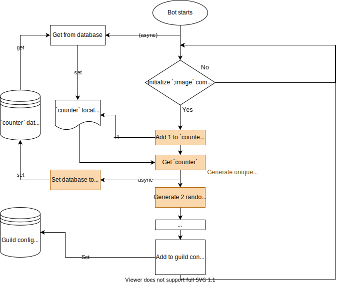

# Fetching Images
This is a guide on how the bot fetches image for use in the `;image` command.

Version 1.0

## Specification
There are 2 "types" of *documents* (the technical name of entries for MongoDB) that the bot uses, a *config entry* for each of the guilds and an *input entry* for each of the images.

### Config entry
The schema or format for the config entry is:
```js
{
  f: true, // document type is a config entry
  g: '764355609973227580', // guild id of the config entry
  _id: '0aa' // unique guild identifier (see below)
  d: {
    e: ['765023219173949440'], // array of excluded channels
    c: 1, // image count for today
    m: '914369938347667486', // message id that initialized the `;image` command
  }
}
```

#### Unique guild identifier
The format of the nickname is: `A normal counter that counts up` + `2 randomly-generated letters`

Discord snowflakes are too long for me[^1], so they're getting nicknames! The requirements for the unique identifier generator is that:
1. it must generate a unique identifier for each guild;
2. it can support generating multiple identifiers in a short amount of time; and
3. it is shorter than a guild id

The method on how the counter works is listed below:
> When the bot comes online, it will fetch the `counter` from the `botInfo` database (if there is one) and save it on a local variable. Then, every time a new guild is initialized, it will add 1 to the counter and then update the `counter` entry in the botInfo.

We need to store the `counter` entry to our database so that if the bot restarts, it can resume on the previous counter. But this generates a new problem, because setting values on the database costs time. So aside from the counter, we also need to add randomly-generated letters.
```js
// We'll only use native Javascript for this part (though I would like to explore the Crypto API in the future)
var randChar = () => 'abcdefghijklmnopqrstuvwxyzABCDEFGHIJKLMNOPQRSTUVWXYZ'.split('')[Math.floor(Math.random() * 52)]
console.log(randChar() + randChar())
```

The above code gives us a total of 52^2 possible combinations (so theoretically, there's 1 in 52^2-1 chance that we'll pick the same combination again). I only opted for letters because our counter is already a number and I want to differentiate the counter from the random combination.



### Input entry
The schema or format for the input entry is:
```js
{
  f: false, // document type is not a config entry
  _id: '914369938347667486', // message id
  g: '0aa', // unique guild identifier (see above)
  c: '765022790038192148', // channel id
  a: '681766482304434187', // author id
  i: 'https://imgurp.com/1DBO2wh.png', // image url
  d: 'Lorem ipsum', // text on the image (using OCRSpace API)
  w: 1000000 // timestamp (see below)
}
```

#### Message timestamp
The timestamp is how many seconds since `October 31, 2021 GMT` (Unix time 1635638400000).
```js
// convert to timestamp
var currentTimestamp = Date.now() / 1000 - 1635638400

// convert to normal date
var timestamp = 1000000
var date = new Date((timestamp + 1635638400) * 1000)
```

For the guild identifier, see: [Unique guild identifier](#unique-guild-identifier)


[^1]: I have a whole separate guide for you! Check [/guides/snowflakes.md](./snowflakes.md).